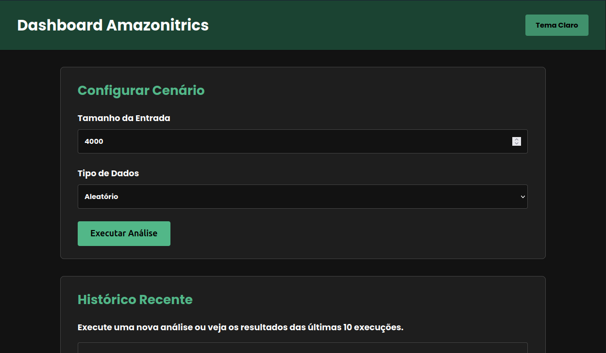
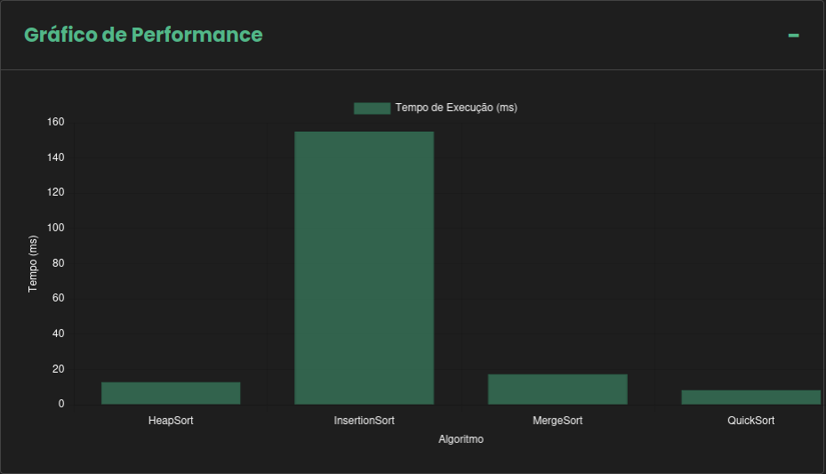
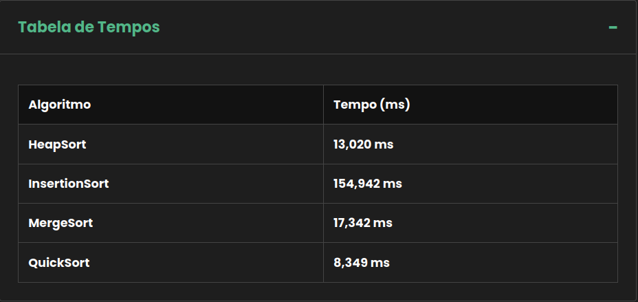
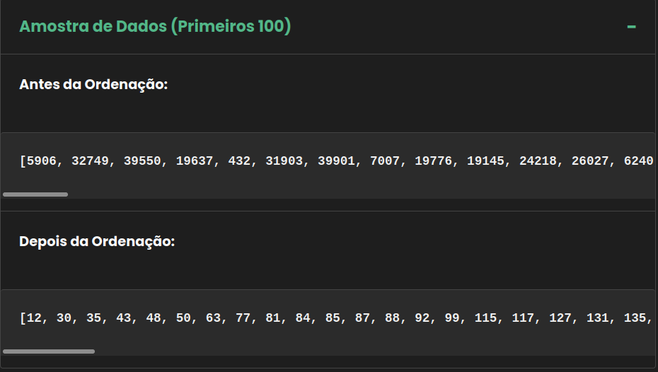

# 🌳 Amazonitrics

<a href="https://www.java.com/"></a>
<a href="https://www.java.com/"></a>
<a href="https://www.java.com/"></a>
<a href="https://www.java.com/"></a>
<a href="https://spring.io/projects/spring-boot"></a>
<a href="https://www.learncpp.com/"></a>
<a href="https://maven.apache.org/"></a>
<a href="https://www.chartjs.org/"></a>

Esse projeto foi desenvolvido como parte das Atividades Práticas Supervisionadas (APS) do curso de Ciência da Computação (CC) da Universidade Paulista, visando criar um sistema computacional completo para análise de performance de algoritmos de ordenação (**HeapSort**, **InsertionSort**, **MergeSort** e **QuickSort**).

Nesse sentido, o **Amazonitrics** é uma ferramenta de benchmark que opera com duas fontes de dados distintas: **dados internos** (gerados aleatoriamente pelo sistema) e **dados externos reais** (metadados de desmatamento da Amazônia fornecidos pelo *TerraBrasilis*). O sistema utiliza uma arquitetura Model-View-Controller (MVC) robusta com dois bancos de dados para garantir a integridade e a separação das responsabilidades dessa nossa ferramenta.

## 📸 Screenshots
> [!NOTE] Nota: as imagens abaixo representam o funcionamento da aplicação.

### Dashboard (Tema Claro)
<div align="center">

</div>

### Dashboard (Tema Escuro)
<div align="center">

</div>

### Resultados da Análise (Gráfico)
<div align="center">

</div>

### Resultados da Análise (Tabela)
<div align="center">

</div>

### Amostra dos Dados
<div align="center">

</div>

## 💻 Pré-requisitos
Antes de iniciar, verifique se você possui todos os requisitos:

- Você possui instalado o **JDK 21** (Java Development Kit) ou superior.
- Você possui instalado o **Maven** para gerenciamento de dependências.
- Você possui instalado o **MariaDB Server** (versão 10.x ou superior) rodando localmente.
- Você possui instalado uma versão estável do `git`.
- Você possui instalado um ambiente de desenvolvimento (IDE), como `IntelliJ IDEA`, `Eclipse` ou `Visual Studio Code (VSCode)` (Com Extension Pack for Java).

## 🔓 Configuração do Banco de Dados
Ademais, antes de instalar as dependências, é necessário preparar os bancos de dados. O sistema utiliza dois bancos de dados: **amazonitrics_benchmark** e **amazonitrics_external**.

Sendo assim, abra seu cliente SQL (DBeaver, HeidiSQL, MySQL Workbench ou terminal) e execute os seguintes comandos:

```sql
CREATE DATABASE IF NOT EXISTS amazonitrics_benchmark;
CREATE DATABASE IF NOT EXISTS amazonitrics_external;
```

> [!IMPORTANT] O sistema está configurado para usar o usuário root por padrão (ou por variáveis de ambiente). Se suas credenciais forem diferentes, configure as variáveis de ambiente MARIADB_USERNAME e MARIADB_PASSWORD ou altere o arquivo src/main/resources/application.properties.

## 🚀 Instalando as dependências (Opcional)
Para instalar as dependências e compilar o projeto, navegue até a pasta raiz (onde está o `pom.xml`) e utilize o Maven.

Sendo assim, para clonar o repositório, use:

```bash
git clone https://github.com/SepulvedaRafael/amazonitrics.git
```

Após isso, navegue até a pasta e execute a instalação:
```bash
cd amazonitrics
mvn clean install
```

Com esse comando, você irá baixar todas as dependências do Spring Boot, Hibernate, MariaDB Server e outras bibliotecas necessárias que estão definidas no `pom.xml`.

## 🔓 Execução via VS Code
Como uma alternativa mais simples e que não exige a instalação do Maven na sua máquina, siga os seguintes passos:

1. Clone o Repositório e abra a pasta no **VS Code**.
2. Certifique-se de ter as seguintes extensões: **Extension Pack for Java**.
3. Navegue até o arquivo principal de execução: `src/main/java/com/amazonitrics/Amazonitrics.java`.
4. Devido a extensão que está baixada, na parte superior da IDE terá um botão pequeno escrito `RUN`.
5. Clique nesse botão e aguarde a execução.

> [!NOTE] O terminal integrado do VS Code abrirá e iniciará o servidor Spring Boot automaticamente.

## 💻 Execução via Terminal (Maven)
Para executar o código e iniciar o servidor web, certifique-se de estar na raiz do projeto e execute o seguinte comando:

```bash
mvn spring-boot:run
```

Assim que a aplicação iniciar, você verá logs indicando a conexão com os bancos de dados e a execução automática do `DataSeeder` , que se for a primeira vez utilizando, irá criar e popular o banco de dados externo. Caso não seja a primeira vez, ele mostrará uma mensagem indicando que o banco de dados externo já foi criado e popularizado.

## 🤖 Utilizando o Dashboard
Para acessar o Amazonitrics, abra seu navegador preferido e acesse a seguinte url:

```bash
http://localhost:8080
```

Em relação as funcionalidades presentes na nossa ferramenta, percebe-se as seguintes:

### ⚙️ Filtros de Cenário
- **Dados Internos:** selecione `Aleatório`, `Ordenado`, `Invertido` ou `Semi-Ordenado` e defina o tamanho da entrada.

> [!NOTE] Leve em conta que quanto maior o tamanho da entrada, mais tempo levará para realizar a análise.

- **Dados Externos:** selecione as opções: `Nº de Polígonos`, `Área` ou `Classe`.

> [!NOTE] O tamanho de entrada é de acordo com a quantidade de registros no banco de dados. No que foi disponibilizado, há exatos 4.114 registros.

### ⌛ Sobre a Execução
- O sistema irá buscar ou gerar os dados.
- Executar os quatros algoritmos de ordenação (Insertion, Quick, Merge e Heap).
- Irá cronometrar o tempo exato da execução de cada algoritmo (em milissegundos).
- Salvará os resultados no banco de dados (`amazonitrics_benchmark`).

### 📊 Visualização dos Resultados
- **Gráfico Interativo:** por meio do `Chart.js` ele irá mostrar um gráfico que compara visualmente a performance de cada um dos algoritmos.

- **Tabelas:** o sistema possibilita ver uma tabela mostrando o tempo exato e em tabela de cada um dos algoritmos.

- **Amostras:** o sistema irá mostrar uma amostra dos 100 primeiros dados que foram gerados ou obtidos, no qual irá conter a visualização de `Antes` e `Depois` da ordenação.

### 🖼️ Personalização
Para ter uma diversificação e implementar uma funcionalidade útil para o usuário, foi implementado o botão no cabeçalho que possibilita a alternância entre o **Tema Claro** e o **Tema Escuro**.

## 📂 Estrutura do Projeto
A arquitetura que foi utilizada, Model-View-Controller (MVC), é uma das mais comuns e recomendadas para projetos Spring Boot, e para isso as separações de responsabilidades foram feitas da seguinte forma:

- **src/main/java/.../config:** Configuração dos bancos de dados `DataSources` e o `DataSeeder`.
- **src/main/java/.../controller:** camada destinada para intermediar a `View` e o `Model`.
- **src/main/java/.../model:** é a pasta possui entidades, DTOs e a lógica dos algoritmos de ordenação generalizados (`<T extends Comparable>)`).
- **src/main/java/.../repository:** é responsável por armazenar as interfaces de acesso aos bancos de dados.
- **src/main/resources/templates:** compõe as Views em `HTML`, juntamente com `Thymeleaf`.
- **src/main/resources/static:** é a pasta que possui toda a estilização e interação do usuário com o sistema. Há a utilização do `Vanilla Framework`.

## 📝 Licença
Esse projeto está sob a *Apache License 2.0*. Veja o arquivo *[LICENSE](LICENSE.md)* para mais detalhes.